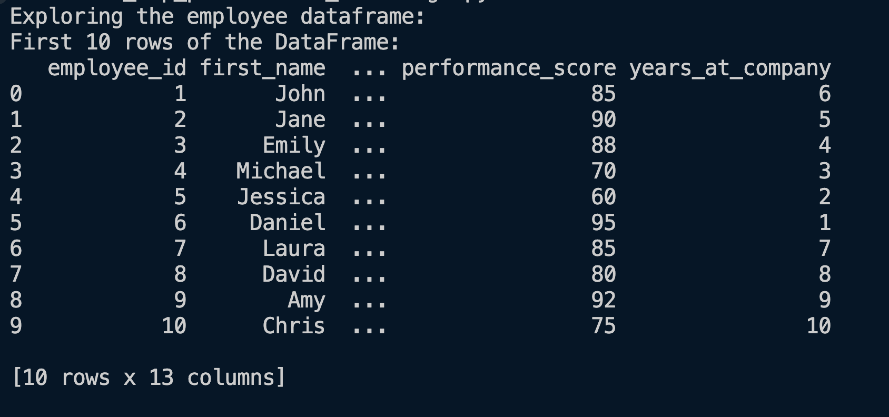
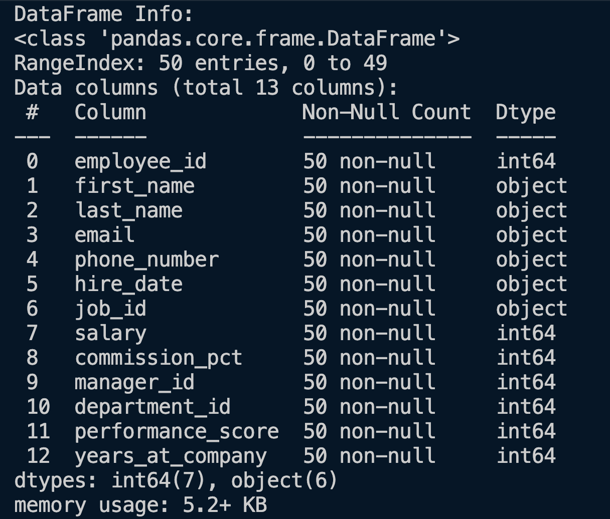
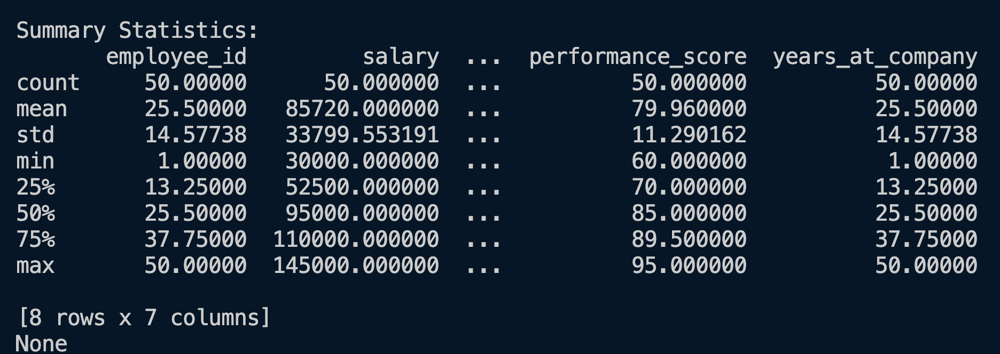
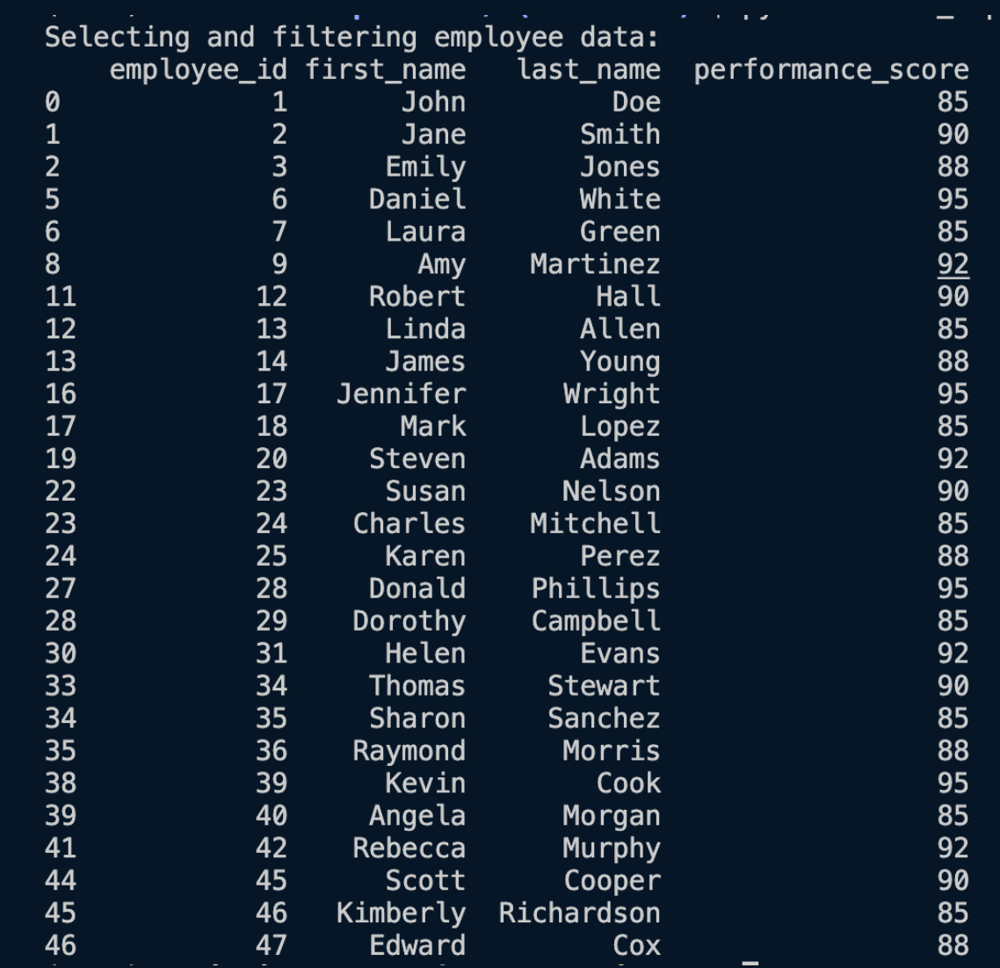
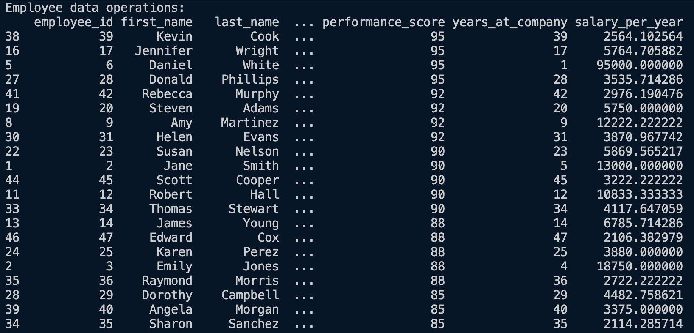
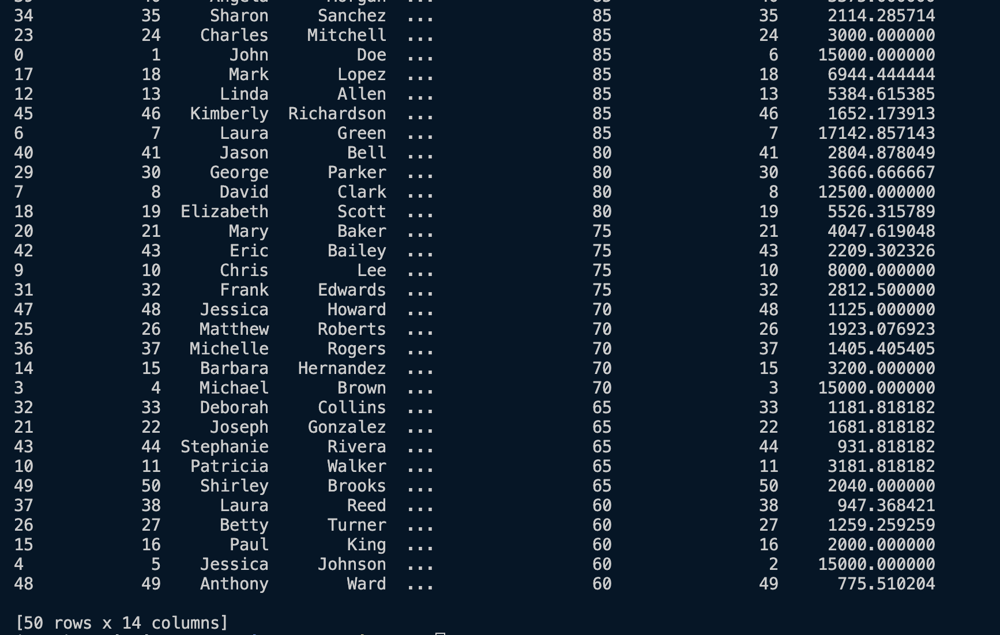
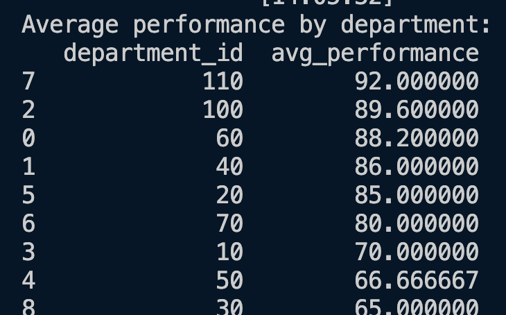
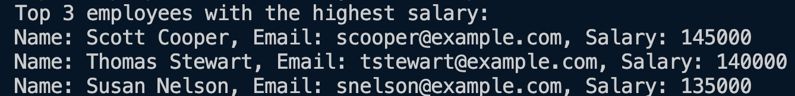
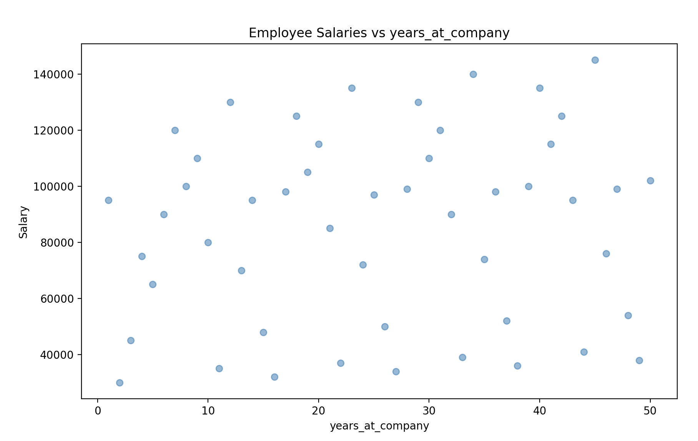

# Employee Performance Challenge - Output Snapshots

Here are snapshots of expected outputs for the project.

### 1. Explore the DataFrame

### 2. Select and Filter Employee Data

### 3. Employee Data Operations

### 4. Average Performance by Department

### 5. Top 3 Employees with Highest Salary

### 6. Plotting Salary vs Years of Experience

[Return to README](./Readme.md)